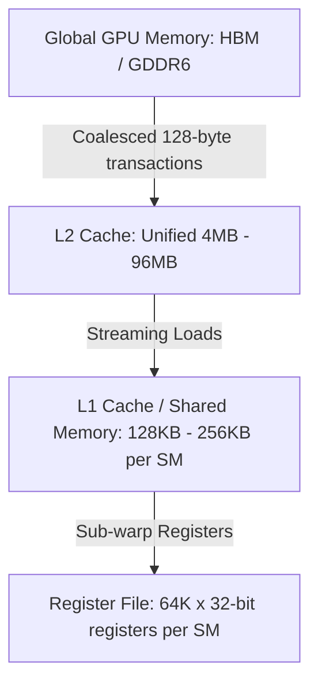

# 🧠 GPU Memory Architecture & Cache Hierarchy for 2D Convolutions

This document analyzes the hardware memory subsystem, caching behavior, and register allocation strategies for the **Convolutional Neural Network (CNN)** CUDA kernels.

---

## 1. Memory Hierarchy Analysis

When computing 2D spatial convolutions, pooling, and GEMM operations on modern NVIDIA GPUs (Ampere, Ada Lovelace, Hopper, Blackwell), data moves through several memory layers:



### 1.1 Arithmetic Intensity of Conv2D
For a Conv2D layer with $N$ samples, $C_{\text{in}}$ input channels, $C_{\text{out}}$ output channels, kernel size $K \times K$, and output resolution $H_{\text{out}} \times W_{\text{out}}$:

- **Floating-Point Operations (FLOPs)**:
  $$\text{FLOPs} = 2 \cdot N \cdot C_{\text{out}} \cdot H_{\text{out}} \cdot W_{\text{out}} \cdot C_{\text{in}} \cdot K_h \cdot K_w$$

- **Global Memory Access (Bytes)**:
  $$\text{Memory Traffic} = 4 \cdot \left( N \cdot C_{\text{in}} \cdot H_{\text{in}} \cdot W_{\text{in}} + C_{\text{out}} \cdot C_{\text{in}} \cdot K_h \cdot K_w + N \cdot C_{\text{out}} \cdot H_{\text{out}} \cdot W_{\text{out}} \right)$$

- **Operational Intensity ($\text{FLOPs} / \text{Byte}$)**:
  $$\mathcal{I}_{\text{conv}} \approx \frac{2 \cdot C_{\text{in}} \cdot K_h \cdot K_w}{1 + \frac{C_{\text{in}} H_{\text{in}} W_{\text{in}}}{C_{\text{out}} H_{\text{out}} W_{\text{out}}}}$$

For $K=3, C_{\text{in}}=16, C_{\text{out}}=32$, the operational intensity is $\mathcal{I}_{\text{conv}} \approx 100 - 280\text{ FLOPs/byte}$, positioning convolution firmly in the **Compute-Bound** regime of the GPU Roofline model.

---

## 2. Memory Access Coalescing in NCHW Format

In PyTorch standard **NCHW** memory layout:
$$\text{Index}(n, c, h, w) = \left( (n \cdot C + c) \cdot H + h \right) \cdot W + w$$

- Contiguous elements along the spatial $W$ axis reside in consecutive memory addresses ($4\text{ bytes}$ apart).
- Threads within a warp ($32\text{ consecutive threads}$) accessing adjacent $(h, w)$ elements coalesce into single $128\text{-byte}$ memory transactions, maximizing L1/L2 cache hit rates and memory bus efficiency.

---

## 3. Shared Memory Tiling for GEMM Layers

For the fully connected classification head, $16 \times 16$ 2D shared-memory tiles are employed:

```cpp
__shared__ float s_X[16][16];
__shared__ float s_W[16][16];
```

- Each tile requires $16 \times 16 \times 4 = 1024\text{ bytes} = 1\text{ KB}$ of shared memory.
- Total shared memory per thread block: $2\text{ KB}$.
- Enables maximum theoretical occupancy with up to 16 active blocks per Streaming Multiprocessor (SM).

---

## 4. Zero-Copy Memory Footprint for In-Place Training

| Buffer Name | Element Count ($N=64$) | Memory Size (KB) | Lifecycle |
| :--- | :--- | :--- | :--- |
| **Input Batch $\mathbf{X}$** | $64 \times 1 \times 28 \times 28$ | $200.7\text{ KB}$ | Preserved for Conv1 $dW$ |
| **Conv1 Feature Map $\mathbf{Z}_1$** | $64 \times 16 \times 28 \times 28$ | $3,211.2\text{ KB}$ | Preserved for ReLU1 backward |
| **MaxPool1 $\mathbf{P}_1$ + Mask** | $64 \times 16 \times 14 \times 14 \times 2$ | $1,605.6\text{ KB}$ | Input to Conv2 + Argmax route |
| **Conv2 Feature Map $\mathbf{Z}_2$** | $64 \times 32 \times 14 \times 14$ | $1,605.6\text{ KB}$ | Preserved for ReLU2 backward |
| **MaxPool2 $\mathbf{P}_2$ + Mask** | $64 \times 32 \times 7 \times 7 \times 2$ | $802.8\text{ KB}$ | Input to FC1 + Argmax route |
| **FC1 Layer $\mathbf{Z}_{\text{fc1}}$** | $64 \times 128$ | $32.8\text{ KB}$ | Preserved for ReLU3 backward |
| **Output Logits $\mathbf{Z}_{\text{fc2}}$** | $64 \times 10$ | $2.5\text{ KB}$ | Softmax loss & gradients |
| **Total Activation Footprint** | — | **$\approx 7.46\text{ MB}$** | High L2 cache residency |
